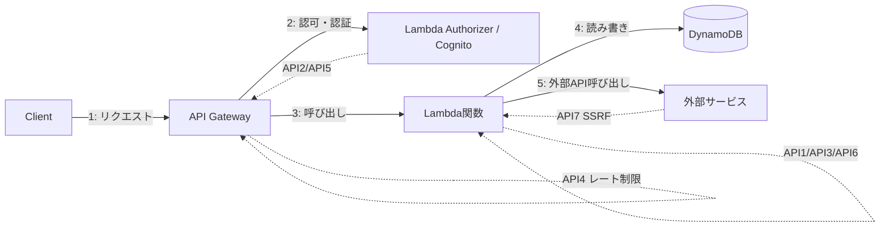

## この記事で得られること

- Qiita/Zennの週間トレンドで「Web API設計の現在地2026」というテーマが複数週にわたって上位に居続けていた背景を踏まえ、API設計を**脆弱性診断の目線**で棚卸しする観点を整理する
- OWASP API Security Top 10（2023年版・最新の正式版）の10項目を、AWS構成（API Gateway + Lambda を想定）に当てはめたときに、どこで発生しやすいかを具体例つきで整理する
- 「機能要件は満たしているAPI設計」と「攻撃者に悪用されないAPI設計」は別軸であるという、診断の現場で繰り返し感じる構図を、実際に診断で頻出する項目に絞って解説する

## 背景：API設計の記事は多いが「攻撃者視点」は少ない

Web API設計に関する技術記事は継続的に人気が高いテーマだが、その多くはリソース設計・バージョニング・エラーハンドリングといった「正しく動くAPI」を作るための観点で書かれている。一方で脆弱性診断の現場で実際に指摘される項目は、機能要件としては正しく動いているのに、権限チェックや入力値の境界条件が甘い、という「動くけど守られていない」パターンがほとんどを占める。

OWASP API Security Top 10は、Webアプリケーション全般を対象とするOWASP Top 10とは別に、API特有のリスクだけを抽出して2019年に初版が出され、2023年に改訂版が出ている。今回はこの2023年版の10項目を軸に、AWSでAPIを構築する際にどこで踏みやすいかを整理する。

## 具体的な取り組み：OWASP API Security Top 10 2023をAWS構成に当てはめる

想定構成は、API Gateway（REST/HTTP API）+ Lambda + DynamoDB という、個人開発・小規模プロダクトでよく使われる構成にした。

### API1:2023 Broken Object Level Authorization（オブジェクトレベル認可の欠落）

`GET /orders/{orderId}` のようなエンドポイントで、`orderId` を書き換えるだけで他人のリソースが見えてしまうパターン。認証（ログインしているか）は通っているが、認可（そのリソースにアクセスしてよいか）のチェックが抜けている状態で、診断で最も指摘頻度が高い項目の一つ。

AWS構成では、Lambda Authorizerでリクエストの認証まではできていても、Lambda関数側でDynamoDBに問い合わせる際に「呼び出し元のユーザーIDとレコードの所有者IDが一致するか」のチェックが抜けているケースで発生する。

### API2:2023 Broken Authentication（認証の不備）

トークンの有効期限が極端に長い、リフレッシュトークンの失効処理がない、パスワードリセットのレート制限がない、といった認証フロー自体の不備。API Gatewayの認証設定（Cognito UserPoolやカスタムAuthorizer）を「設定した」だけで安心せず、トークンの失効・再発行のフローまで実装されているかを見る。

### API3:2023 Broken Object Property Level Authorization（プロパティレベル認可の欠落）

旧版の「Excessive Data Exposure（過剰なデータ露出）」と「Mass Assignment（意図しない項目の書き換え）」が統合された項目。レスポンスに内部用フィールド（`isAdmin` や `internalNote` など）まで含めて返してしまう、逆にリクエストボディで `role: "admin"` のような項目を送ると意図せず更新できてしまう、という2方向の問題を指す。

DynamoDBのようなスキーマレスDBと組み合わせたLambdaでは、受け取ったJSONをそのまま `UpdateItem` に渡す実装が起きやすく、この項目に該当しやすい。

### API4:2023 Unrestricted Resource Consumption（無制限なリソース消費）

ページネーションの上限がない、リクエストボディサイズの制限がない、Lambdaの同時実行数に上限がない、といった状態。悪意がなくても大量リクエストでコストが跳ね上がる可能性があり、セキュリティだけでなくAWS利用料の観点でも実害が出やすい項目。API Gatewayのスロットリング設定・使用量プランは初期状態では緩めなことが多く、明示的に絞る必要がある。

### API5:2023 Broken Function Level Authorization（機能レベル認可の欠落）

一般ユーザー向けのエンドポイントと管理者向けのエンドポイントが同じベースパスに同居しており、URLを推測されると管理者機能に到達できてしまうパターン。API1が「どのリソースか」の認可なのに対し、API5は「どの機能か」の認可という違いがある。

### API6:2023 Unrestricted Access to Sensitive Business Flows（業務フローへの無制限アクセス）

2023年版で新設された項目。個々のAPIエンドポイントは正しく認可されていても、「予約を大量に自動連打して在庫を独占する」「クーポン発行APIを連打する」といった、ビジネスロジック単位での悪用を防げていない状態を指す。技術的な脆弱性ではなく設計上の考慮漏れであるため、自動スキャナでは見つけにくく、診断でも人手でのロジック確認が必要になる項目。

### API7:2023 Server Side Request Forgery（SSRF）

APIがユーザー指定のURLを受け取って外部リクエストを行う機能（Webhook登録、画像取得など）を持つ場合、そのURLにAWSのメタデータエンドポイント（`169.254.169.254`）やVPC内部のプライベートIPを指定されると、サーバー側から内部リソースにアクセスされてしまう。Lambda + VPC構成では特に影響範囲が大きくなりやすく、IMDSv2の強制やアウトバウンド先の許可リスト化が対策になる。

### API8:2023 Security Misconfigurations（セキュリティ設定不備）

CORS設定が `*` で全許可になっている、詳細なスタックトレースをエラーレスポンスにそのまま返している、不要なHTTPメソッドが有効なままになっている、といった設定不備全般。個別の脆弱性というより「初期設定のまま」「デバッグ用の設定を本番に残した」ことが原因になるケースが多い。

### API9:2023 Improper Inventory Management（不適切なインベントリ管理）

過去バージョンのAPI（`v1` エンドポイント）が廃止されずに残っている、ステージング環境用のAPIが本番と同じドメインに公開されたままになっている、といった「存在を把握できていないAPI」に関する項目。API Gatewayでステージを複数運用していると、古いステージの無効化を忘れやすい。

### API10:2023 Unsafe Consumption of APIs（外部APIの安全でない利用）

自分のAPIではなく、自分のAPIが呼び出している外部APIのレスポンスを無条件に信頼してしまう問題。外部APIのレスポンスをそのままDBに保存する、リダイレクト先を検証せずに追跡する、といった実装が該当する。サードパーティ連携が多いAPIほどこの項目のリスクが上がる。

## 知見・まとめ

| 項目 | 一言でいうと | AWS構成での典型的な原因 |
|---|---|---|
| API1 所有者チェック漏れ | 認証はあるが認可がない | Lambda内でリソース所有者IDの照合を省略 |
| API2 認証フロー不備 | トークン管理が甘い | 失効・再発行フローの未実装 |
| API3 プロパティ露出/書換 | 返す/受け取るフィールドの絞り込み不足 | リクエストJSONをそのままUpdateItemに渡す |
| API4 リソース消費無制限 | 量に上限がない | スロットリング・使用量プラン未設定 |
| API5 機能レベル認可漏れ | 管理者機能への到達性 | 管理者用エンドポイントの分離不足 |
| API6 業務フロー悪用 | ロジック単位の悪用防止不足 | レート制限のみでロジック検証なし |
| API7 SSRF | サーバー側から内部への到達 | IMDSv2未強制・許可リスト未整備 |
| API8 設定不備 | 初期設定のまま | CORS全許可・詳細エラー露出 |
| API9 インベントリ不備 | 存在を把握できないAPI | 旧ステージの放置 |
| API10 外部API過信 | 外部レスポンスを無検証で利用 | サードパーティ連携の検証不足 |

自分がAWS構成のAPIを診断・レビューした際、この10項目のうちどれかに該当する指摘が出た割合は `[ここに実際の割合を記入]` 程度だった（案件ごとの構成差が大きいため参考値扱い）。体感として最も指摘頻度が高いのはAPI1（所有者チェック漏れ）とAPI8（設定不備）で、この2つは実装工数をかけずに気づける項目でもあるため、優先して確認する価値が高い。

## 代替手段の比較

| アプローチ | メリット | デメリット |
|---|---|---|
| 自動スキャナ（DAST等） | 継続的に低コストで実行できる | API6のようなビジネスロジック起因の項目は検出できない |
| OWASP Top 10チェックリストによる自己レビュー | コストゼロで着手できる | チェックする人の知識・経験に精度が依存する |
| 第三者によるAPI診断 | ロジック単位の悪用シナリオまで確認できる | コストと時間がかかり、継続的な実施が難しい |
| Infrastructure as CodeでのCORS/スロットリング標準化 | API4/API8のような設定不備を仕組みで予防できる | ロジック起因の項目（API1/API6）は防げない |

自動スキャナとIaCでの標準化は「設定不備」系（API4/API8/API9）の予防には効くが、「認可・ロジック」系（API1/API3/API5/API6）は人間によるレビューが依然として必要、という住み分けが実感として強い。

## Q&A

**Q. OWASP API Security Top 10とOWASP Top 10（Webアプリ全般）はどちらを見ればいいか？**
A. 対象がWebアプリのUIも含む場合はOWASP Top 10、API単体（バックエンド・BFF）を対象とする場合はAPI Security Top 10を主軸にするのが実務的。両者は重なる部分もあるが、API Security Top 10のほうがAPI特有の項目（API1/API3/API6など）を細かく扱っている。

**Q. サーバーレス（Lambda）構成だとオンプレ・EC2構成より安全か？**
A. インフラ管理の負担（OSパッチ適用など）は減るが、OWASP API Security Top 10の項目自体はインフラ形態に関係なく発生する。特にAPI7（SSRF）はLambdaがVPC内リソースやメタデータエンドポイントにアクセスできる構成だとむしろ影響範囲が広がりやすい。

**Q. 個人開発の小規模APIでもここまでやる必要があるか？**
A. 全項目を厳密にやる必要はないが、API1（所有者チェック）とAPI8（CORS/エラー露出）は実装コストが低く効果が大きいため、個人開発でも最低限確認する価値がある。API6のようなビジネスロジック起因の項目は、実際に不正利用されるリスクとコストを見て優先度を判断すればよい。

## 参考リンク

- [OWASP API Security Project](https://owasp.org/www-project-api-security/)
- [2023 OWASP API Security Top 10](https://owasp.org/API-Security/editions/2023/en/0x11-t10/)
- [OWASP API Security Top 10 2023 Explained - Salt Security](https://salt.security/blog/owasp-api-security-top-10-explained)
- [Web Security Academy alignment with the OWASP Top 10 API vulnerabilities - PortSwigger](https://portswigger.net/web-security/api-testing/top-10-api-vulnerabilities)
