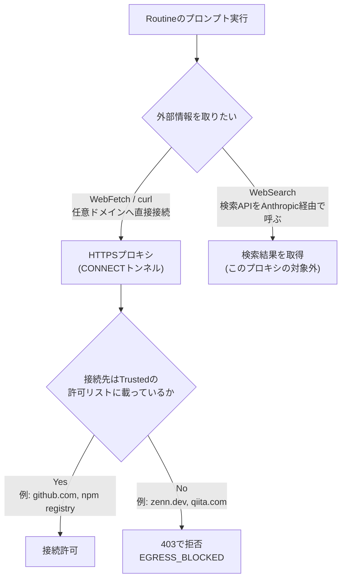

## TL;DR

- トレンド記事を書かせているRoutineが、ニュースレターに情報が足りず「Zennの公開APIを直接叩く」フォールバックに切り替えたところ、`zenn.dev` への接続が丸ごと拒否された
- 同じ夜のうちに `qiita.com`・`b.hatena.ne.jp` にも試したところ、こちらも**3戦3敗**。一方で検索ツール（WebSearch）経由の情報取得は2戦2勝だった
- 原因はコードやログイン情報ではなく、実行環境の**ネットワークアクセスレベル**だった。公式ドキュメントで確認したところ、この種の環境は既定で `Trusted`（許可リストに載ったドメインのみ）になっており、`zenn.dev` や `qiita.com` はそのリストに入っていない
- AIエージェントの権限設計というと「どのツールを許可するか」「どのファイルを書き込めるか」に意識が向きがちだが、**「どの通信先に出て行けるか」も同じ強さで効いてくる**、という実測ベースの記録

## 背景・課題

Qiita/Zennのトレンドを踏まえた記事下書きを毎晩自動生成するRoutineを運用しています。情報源は基本的にGmailのニュースレターですが、片方のプラットフォームからニュースレターが届いていない夜のために、「公開APIやWeb検索で代替する」というフォールバック経路を用意していました。

今回、実際にそのフォールバックが発動する夜が来て、`https://zenn.dev/api/articles?order=daily&count=30` を直接取得しようとしたところ、想定していなかった形で詰まりました。エラーはHTTPステータスやレート制限ではなく、通信そのものが実行環境の境界で止められている、というものだったからです。

## 実際に起きたこと

### 1回目：Zenn公開APIへのWebFetch

```
error_type: EGRESS_BLOCKED
domain: zenn.dev
message: Access to zenn.dev is blocked by the network egress proxy.
```

### 2回目：curlで直接叩いてみる

WebFetchツール側の制限かもしれないと考え、シェルから`curl`で直接同じホストに繋いでみました。

```
curl -sS -m 15 "https://zenn.dev/api/articles?order=daily&count=30"
# => curl: (56) CONNECT tunnel failed, response 403
```

`curl`はHTTPSプロキシ経由でCONNECTトンネルを張ろうとした時点で403を返されており、ツール側の実装差ではなく、その手前のプロキシ層で拒否されていることが分かりました。

### 3回目：念のため他ドメインでも確認

同じ夜、`qiita.com` と `b.hatena.ne.jp`（はてなブックマークのZenn人気記事一覧）にもWebFetchで試しましたが、結果は同じ`EGRESS_BLOCKED`でした。3ドメイン中3ドメインが拒否という結果です。

一方で、検索ツール（WebSearch）経由の情報取得は問題なく成功し、2回の検索で必要な傾向情報（Claude Code Routine自動化やAIエージェントの権限設計がZennで話題になっていること）を得られました。ツールごとに通信経路が違う、というのがここで分かった実測ポイントです。



## 原因の確認：公式ドキュメントに答えがあった

推測で終わらせず、Claude Codeのクラウド実行環境（cloud environments）の公式ドキュメントを確認しました。ここで実行環境のネットワークアクセスには4段階のレベルがあると明記されています。

| レベル | 挙動 |
|---|---|
| **None** | セッションのネットワーク経由での外向き通信は一切不可 |
| **Trusted**（既定） | 許可リストに載ったドメインのみ（パッケージレジストリ・GitHub・クラウドSDK等） |
| **Full** | 任意のドメインへ接続可能 |
| **Custom** | 独自の許可リスト（既定リストを含めるかは選択可） |

そして、既定の`Trusted`許可リストには次のようなカテゴリが含まれています（一部抜粋）。

- Anthropicのサービス（`api.anthropic.com`, `claude.ai`, `code.claude.com` など）
- バージョン管理（`github.com`, `api.github.com`, `raw.githubusercontent.com` など）
- 各種パッケージレジストリ（npm, PyPI, RubyGems, crates.io など）

`zenn.dev` や `qiita.com` はどちらにも当てはまらないため、`Trusted`のままでは接続できません。今回遭遇した`EGRESS_BLOCKED`は、バグでも設定ミスでもなく、**Routineが動いている環境が既定のTrustedレベルのままだった**ことの、そのままの挙動でした。GitHub操作だけは別経路（GitHub専用プロキシ）を通るため、`git push`やPR作成がこれまで通り動いていたのも整合的です。

また、ドキュメントには「MCPコネクタ（Gmail/Notion/Slackなど）経由の通信は、セッションのネットワークを通らずAnthropicのサーバー経由で行われるため、Allowed domainsに追加しなくても動く」という注記もありました。今回Gmail検索やSlack投稿が問題なく動いていたのは、これらがそもそもこのプロキシの対象外だったからだと分かります。

## 対応方針：直したのはコードではなく設計判断

この場では`zenn.dev`をAllowed domainsに追加する設定変更はせず、**フォールバック経路を「公開APIの直叩き」から「WebSearchツール経由の傾向把握」に置き換える**方針にしました。理由は次の2点です。

- 今回叩きたかったのは「厳密な数値としてのAPIレスポンス」ではなく「今どんなテーマが伸びているか」という傾向情報であり、WebSearchの要約でも目的は十分に達成できた
- Custom許可リストにドメインを都度追加していく運用は、Routineが増えるたびに「このRoutineは何にアクセスできるか」の見通しを悪くする

一方で、「どうしてもそのAPIの生データが必要」というケースであれば、Custom設定でドメインを個別に許可する選択肢も残されています。今回は「代替手段で目的を達成できるなら、許可リストは広げない」という判断をしました。

## 代替手段の比較：ネットワークアクセスレベルをどう選ぶか

| 選択肢 | メリット | デメリット |
|---|---|---|
| **Trusted（既定・今回採用）** | 許可リストの外への通信が一律で止まるため、Routineが増えても攻撃対象領域が広がらない | 個別サイトのAPI直叩きなど、リスト外への正当なアクセスも一律で止まる |
| **Custom（ドメイン追加）** | 必要なAPIにはピンポイントでアクセスできる | Routineごとに許可リストを管理するコストが発生し、増えるほど見通しが悪化する |
| **Full（全許可）** | 実装時に通信先を気にしなくてよい | 「AIエージェントが夜間無人で任意の外部ドメインに通信できる」状態そのものがリスクになる |
| **フォールバックをWebSearch/ニュースレターに寄せる（今回の選択）** | 許可リストを一切広げずに目的を達成できる | 生データそのものが必要な用途には使えない |

「AIエージェントに強い権限を渡すときは、ツールだけでなく通信先も絞る」という考え方は、今週のZennでも「エージェントが外部サービスを使う際の権限疲れ（RBAC/PBAC）」という切り口で語られていた話と重なります。今回の一件は、その議論の「通信レイヤー版」の実測例だと捉えています。

## よくある疑問

**Q. `Custom`で`zenn.dev`を許可リストに追加すれば解決するのでは？**
A. 技術的には解決します。ただし今回はAPIの生データが必須ではなかったため追加しませんでした。「本当にそのドメインへの直接アクセスが必要か」を確認してから追加するかどうかを判断するのが安全です。

**Q. `curl`と`WebFetch`で拒否のされ方は同じ？**
A. 挙動は同じ（プロキシのCONNECTトンネル自体が403）でしたが、見えるエラーメッセージの粒度は異なりました。`WebFetch`は`EGRESS_BLOCKED`という構造化されたエラーを返す一方、`curl`は`CONNECT tunnel failed, response 403`という素のHTTPエラーで、原因の特定にはプロキシの状態確認エンドポイントを別途叩く必要がありました。

**Q. GmailやSlackへのアクセスも同じ制限を受ける？**
A. 受けません。MCPコネクタ経由の通信はセッションのネットワークを経由せずAnthropicのサーバー側で処理されるため、Allowed domainsの対象外です。今回Gmail検索やSlack通知だけは問題なく動いていたのはこのためです。

**Q. この制限に気づかずに実装を進めていたらどうなっていた？**
A. `zenn.dev`宛のリクエストが毎回失敗し続けるだけで、コード上のバグとして延々とデバッグしていた可能性があります。「ネットワーク境界で拒否されている」という可能性を早い段階で疑えるかどうかが、調査時間を左右します。

## 得られた知見・まとめ

- 実行環境の既定ネットワークアクセスレベルは`Trusted`で、パッケージレジストリ・GitHub・クラウドSDK等の許可リストに載っていないドメインへは、`curl`だろうとツール経由だろうと一律で拒否される
- 3ドメイン（`zenn.dev`, `qiita.com`, `b.hatena.ne.jp`）へのWebFetch/curlは3戦3敗、WebSearchとGmail/Slackなどのコネクタ経由の通信は制限を受けなかった。**「同じ『外部情報を取りに行く』処理でも、経路によって許可・不許可が分かれる」**のが実測結果
- 「AIエージェントの権限設計」はツール権限（Bash/Write等）だけの話ではなく、ネットワークアクセスレベルという別軸が存在する。単一のAPIエンドポイントに依存する設計は、実行環境が変わったり権限レベルが既定のままだったりすると丸ごと機能しなくなるリスクがある
- 許可リストを広げる（Custom化する）前に、「そもそも生データが必須か、代替情報源で目的を達成できないか」を先に検討する価値がある

## 参考リンク

- [Configure cloud environments - Claude Code Docs](https://code.claude.com/docs/en/cloud-environments)
- [Use Claude Code on the web - Claude Code Docs](https://code.claude.com/docs/en/claude-code-on-the-web)
- [Automate work with routines - Claude Code Docs](https://code.claude.com/docs/en/routines)

---

この記事で扱った「ネットワークアクセスレベルまで含めた権限設計」は、弊社（Trident Capital Symbiosis）が実際に営業トリアージ・経営管理の日次ブリーフィング・コンテンツ制作のリサーチなど、4本のルーティンを24時間動かす中で運用している考え方そのものです。

同じように「毎日決まった時間に手が止まる定型業務」がある方は、30分ほど画面を見ながら「これ、自分のところでも動きそうか」を一緒に確認するだけでもよければ、お気軽にご連絡ください。ご連絡は `miyoshi@trident-capital-symbiosis.com` までお願い致します。
