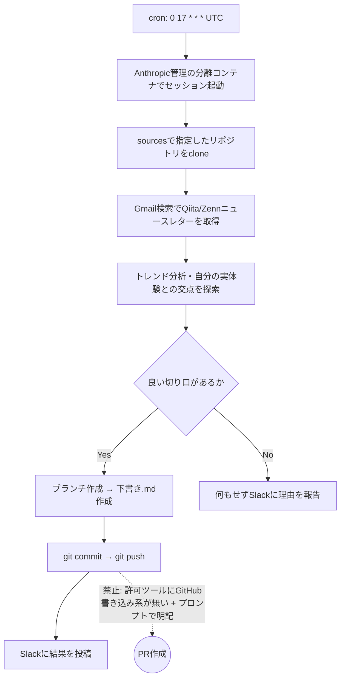

## この記事で得られること

- 「夜間バッチを完全無人で回すには `--dangerously-skip-permissions` ＋ 隔離環境（EC2+tmux）が必要そう」と結論づけた前回の続き。5日後に実際に導入したのは、EC2ではなく Claude Code Remote の **Routine（スケジュールトリガー）** だったという方針転換の記録
- Routine の実体（`allowed_tools` / `sources` / `cron_expression`）を実際の設定値で確認し、「`git push` はできるのに `git commit -m` でmainに直接コミットしたりPRを作成したりはさせない」というガードレールが、ツール権限ではなく**プロンプト内の明示的な禁止指示**で担保されていた、という設計上の事実
- cronはUTC入力必須で、JSTで「毎晩深夜2時」のつもりが日付をまたいでズレる罠
- 外部APIを直叩きする設計（Zennのトレンド取得）が、実行環境のネットワークポリシーで丸ごとブロックされた実録（エラーメッセージ付き）
- 本記事は、この自動化パイプライン自身が作成から約3時間後に初めて実行されたログをもとに書いている一次情報

## 背景：前回、隔離環境の話は「保留」にしていた

以前、Zenn/Qiitaのトレンドを調べて記事を書き、コミット・pushまでを夜間に無人で回そうとしたら、承認リスト（`permissions.allow`）に登録していない `git push` や `gh pr create` の手前で毎回止まる、という事象を検証しました。結論として、許可リスト方式（コマンドの事前ホワイトリスト化）と、`--dangerously-skip-permissions` / `--permission-mode bypassPermissions`（チェックそのものを丸ごとスキップ）は別レイヤーの話であり、後者は公式ヘルプに **"Recommended only for sandboxes with no internet access."** と明記されている以上、普段使いのマシンでそのまま使うのは危険だと判断しました。

そこで代替案として挙げていたのが、「使い捨てできる隔離環境（ネットワークやIAM権限を絞ったEC2インスタンスなど）を用意し、その中だけで `bypassPermissions` を使う」という構成でした。ただし記事の最後には「この構成はまだ実装していません」と書いて宿題にしていました。

5日後の今、実際に導入したのは EC2+tmux ではありませんでした。

## 実際に選んだもの：Claude Code Remote の Routine

Claude Code には、プロンプト・対象リポジトリ・connector（Gmail/Slack/Notion等）をひとまとめにして、スケジュールやAPIコール、GitHubイベントをトリガーに自動実行する **Routine** という仕組みがあります。公式ドキュメントには次のように説明されています。

> Routines execute on Anthropic-managed cloud infrastructure, so they keep working when your laptop is closed.

つまり「隔離環境をどう自前で作るか」という前回の問い自体が、Routineを使う前提では発生しません。管理された分離実行環境がプラットフォーム側の機能として最初から用意されているためです。EC2+tmuxの構想は、自分でスケジューラ・ネットワーク境界・プロセス生存監視まで面倒を見る前提でしたが、Routineはそのレイヤーを丸ごと肩代わりします。

今回組んだRoutine（この記事を生成しているパイプラインそのもの）の実際の設定は次の通りでした。

- `cron_expression`: `0 17 * * *`（UTC 17:00 = JST 翌2:05稼働。実際の初回起動もJST換算で日付をまたいでいた）
- `created_at`: 2026-08-13 16:02 UTC（JST 2026-08-14 01:02）
- 初回発火（`last_fired_at`）: 2026-08-13 19:05 UTC（JST 2026-08-14 04:05）— 作成からおよそ3時間後
- `job_config.ccr.session_context.allowed_tools`: 11個（`Bash` / `Read` / `Write` / `Edit` / `Glob` / `Grep` / `WebFetch` / Gmail検索系2つ / Slackチャンネル検索・送信2つ）
- `job_config.ccr.session_context.sources`: 対象2リポジトリの `git_repository` URL



## つまずき①：`allowed_tools` に `Bash` はあるのに、PR作成ツールは無い

`allowed_tools` の中身を実際に見て気づいたのは、`Bash` は許可されているので理論上 `git push` はできる（実際に本記事もこの経路でpushしている）一方、`mcp__github__create_pull_request` のようなGitHub書き込み系ツールは**ひとつも許可リストに入っていない**という点でした。

一見「ツール権限でPR作成だけを技術的にブロックしている」ように見えますが、正確には少し違います。GitHubリポジトリを `sources` に指定するとGitHub操作用のツール自体はセッションに存在しうるため、`push` はできて `PR作成` だけを完全にツール側で物理的に塞いでいる、と言い切るには検証が必要でした（実際に試すとPR作成という「厳守事項で禁止されている行為」を実行することになるため、今回は検証していません）。

代わりに確認できたのは、Routineのプロンプト本文に次の一文が**そのまま2回**書かれていたことです。

- 「push・PR作成のうちPR作成のみ絶対禁止。ブランチのpushまでは自動で行ってよい」
- 「mainブランチへの直接コミット・pushは絶対禁止」

つまり今回のガードレールは、「ツール自体を渡さない」設計と「渡したツールの使い方をプロンプトで縛る」設計のハイブリッドです。`Bash` を丸ごと許可した時点で、原理的には `git push origin main` すら実行可能な状態にあり、それを止めているのは最終的にはモデルが指示に従うことへの信頼です。前回の記事で書いた「許可リスト方式とフルバイパスは別レイヤー」という話の延長線上にある、もう一段細かい話でした。

## つまずき②：cronはUTC必須。JSTの「深夜」は日付をまたぐ

Routine作成時のcron指定はUTC評価です。「日本時間で深夜2時に動かしたい」つもりで `0 17 * * *`（UTC 17:00）と指定しましたが、これはJSTでは**日付が変わった直後の翌1〜2時台**になります。実際、`created_at` はUTC 16:02（JST換算だと2026-08-14 01:02）で、体感の「2026-08-13の夜」とはズレていました。日次バッチをJSTの特定時刻で動かしたい場合、UTC変換時に日付フィールドまでズレていないか確認する必要があります。

## つまずき③：外部APIの直叩きは、実行環境のネットワークポリシー次第で丸ごと失敗する

トレンド取得のフローでは「Zennからのニュースレターが0件なら `https://zenn.dev/api/articles?order=daily&count=30` を直接取得する」という設計にしていました。実際に今回Zennのニュースレターは0件だったため、このAPIを叩きに行きましたが、結果は次の通りでした。

```
EGRESS_BLOCKED: Access to zenn.dev is blocked by the network egress proxy.
```

`curl` で直接叩いても同様に、プロキシのCONNECTトンネル自体が403で拒否されました。Qiitaはメールニュースレター経由のためこの制約を受けませんでしたが、Zennだけは実行環境のネットワークポリシー次第で情報源が丸ごと消える、という非対称なリスクが可視化されました。ニュースレターという一次経路と、API直叩きという二次経路の両方を用意していたにもかかわらず、二次経路側が環境要因で機能しない、という組み合わせは設計時には想定していませんでした。

## 得られた知見・まとめ

- 夜間バッチの無人化に、EC2+tmuxのような自前の隔離環境は必須ではなかった。Claude Code Remoteの管理された分離実行環境（Routine）がその役割を代替した
- ただし「危険な操作をさせない」設計は、結局「ツールを渡さない」か「渡した上で指示で縛る」かのどちらか、または両方の組み合わせにならざるを得ない。今回の構成は後者（プロンプトでの明示的な二重の禁止文言）に強く依存している
- cronはUTC基準。JSTでの意図した時刻とズレていないか、作成直後に`created_at`/`next_run_at`で必ず確認する
- 外部サイトのAPIを直叩きする設計は、実行環境のネットワークポリシーに依存する。ニュースレターやRSSなど、経路をなるべく分散させておくと安全

## よくある疑問

**Q. `bypassPermissions` を使わずに、`Bash` を丸ごと許可して本当に安全なのか？**
A. 「壊れても被害範囲が閉じている」ことが前提のEC2案と違い、今回は「対象リポジトリ2つへのgit操作以外に実害のある操作をさせない」ことを、connectorのスコープ（GmailはOAuth経由の読み取り検索のみ、SlackはPublicチャンネル検索・送信のみ）とプロンプトの明示的な禁止で担保しています。完全な技術的強制ではなく、リスクを許容範囲まで下げる設計だという理解が正確です。

**Q. Routineは複数同時に動かせるのか？**
A. 動かせます。今回の環境では、この記事執筆用のRoutineとは別に、用途の異なる日次・時次のRoutineが同一環境内で並行稼働していました。それぞれ許可ツールとconnectorのスコープを別々に絞っており、1つのRoutineの権限が別のRoutineに波及しない設計になっていました。

**Q. 前回のEC2+tmux案は無駄だったのか？**
A. 無駄ではなく、今回の結論を出す前提知識になりました。「フルバイパスは隔離環境とセットが前提」という理解があったからこそ、Routineが提供する分離実行環境がその代替になり得ると判断できました。

## 参考リンク

- [Automate work with routines - Claude Code Docs](https://code.claude.com/docs/en/routines)
- [Run prompts on a schedule - Claude Code Docs](https://code.claude.com/docs/en/scheduled-tasks)
- [Claude Code on the web - Overview](https://code.claude.com/docs/en/claude-code-on-the-web)

※本記事は個人のClaude Code Remote環境で確認した内容です。Routineの挙動は執筆時点でリサーチプレビュー段階であり、将来変わる可能性があります。
