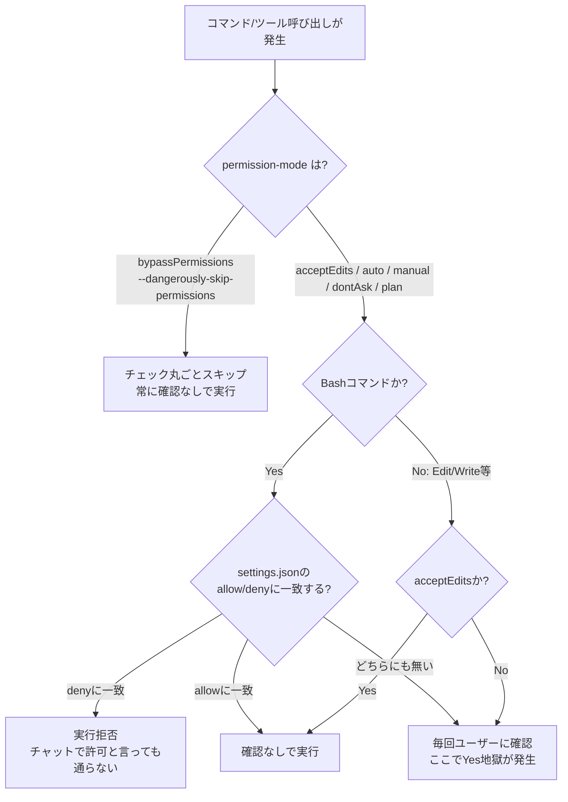
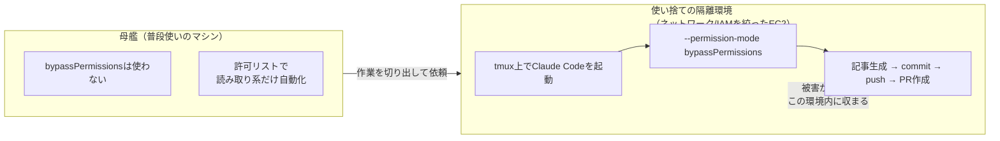

## この記事で得られること

- 「調査系コマンドの承認をゼロにする」設定（許可リスト方式）と、「夜間バッチで記事生成→コミット→push→PR作成まで無人で回す」ことの間にあったギャップ
- `claude --help` を実際に読んで見つけた、許可リスト方式とは別レイヤーの権限モード（`--permission-mode`、`--dangerously-skip-permissions`）
- なぜそれを普段使いの環境でそのまま使うのは危険か、どう安全に使うべきか

以前、[【コピペOK】Kiro/Claude Codeの「信頼済みコマンド」設定で調査作業の承認を完全自動化する](https://qiita.com/geeknow112/items/894b16b584ab0e83dce5)という記事を書きました。この設定を入れれば夜間バッチも完全無人で回るはず、と思っていたのですが、実際にはpush前後で止まりました。原因を調べた記録です。

## 背景：「動くはず」が動かなかった

過去に公開した記事では、`grep` / `cat` / `git log` のような**読み取り専用コマンド**を `.claude/settings.json` の `permissions.allow` に登録し、調査作業の承認を20回→0回にする、という内容を紹介しました。

これをベースに、「Zenn/Qiitaのトレンドを調べて記事を書き、コミットしてpushしてPRを作る」という一連の作業を夜間に無人で回そうとしたところ、`git push` や `gh pr create` の手前で止まる、あるいは許可リストに追加してもセッション中は反映されない、という事象に遭遇しました。

## 原因：許可リストは最初から書き込み系コマンドを対象外にしていた

過去記事の許可リストを見直すと、意図的に以下を**除外**していました。

- `git push` / `git commit`
- `gh pr create`
- ファイルの新規作成・書き換えを伴うコマンド全般

これは安全性を優先した設計で、「読み取り専用の調査作業」の承認疲れを解消することが目的でした。書き込みを伴う完全無人化は、そもそもその記事のスコープ外だったということです。「1回設定すればすべての調査タスクで効果を発揮する」とは書きましたが、「すべての作業が無人化できる」とは書いていなかった、というのが実態でした。

## claude --helpを読み直して見つけたもの

実際にインストールされている `claude` コマンドのヘルプを確認したところ、許可リスト（`permissions.allow`/`deny`）とは別に、以下のオプションが存在することが分かりました。

```
--permission-mode <mode>              Permission mode to use for the session
                                       (choices: "acceptEdits", "auto",
                                       "bypassPermissions", "manual",
                                       "dontAsk", "plan")

--dangerously-skip-permissions        Bypass all permission checks.
                                       Recommended only for sandboxes with no
                                       internet access.

--allow-dangerously-skip-permissions  Enable bypassing all permission checks
                                       as an option, without it being enabled
                                       by default. Recommended only for
                                       sandboxes with no internet access.
```

つまり、許可リストは「個別のコマンドパターンをホワイトリスト化する」レイヤーで、`--dangerously-skip-permissions` / `--permission-mode bypassPermissions` は「そのレイヤーごとスキップする」レイヤーです。両者は別物でした。

自分の `.claude/settings.json` は `defaultMode: "acceptEdits"` になっていましたが、これはファイル編集（Edit/Write）の確認を自動承認するモードで、許可リストに無いBashコマンドの確認までは免除しません。「acceptEdits にしているのに止まる」のは、そもそも見ているレイヤーが違ったから、という結論になりました。図にすると、こういう関係です。



過去記事の許可リスト（`grep`/`cat`/`git log`など）は図でいう「E: allowに一致」の枝だけを充実させたものでした。`git push` や `gh pr create` はそこに登録していなかったので「H: 毎回確認」に落ち、夜間バッチはそこで止まっていた、ということです。

## なぜ普段の環境でそのまま使わないか

`--dangerously-skip-permissions` は公式ヘルプに **"Recommended only for sandboxes with no internet access"**（インターネット接続のないサンドボックスでのみ推奨）と明記されています。

普段使いのマシンでこれを有効にすると、たとえば作業中に読み込んだWebページやリポジトリの内容に悪意ある指示が仕込まれていた場合（プロンプトインジェクション）、それを疑いなく実行してしまうリスクがあります。許可リスト方式が「何を許すか」を人間が事前に決める仕組みなのに対し、フルバイパスは「エージェントの判断を全面的に信頼する」仕組みなので、リスクの質が違います。

## 安全に無人化するなら、という設計方針

Zennのトレンドを見ていて見つけた [PC を閉じても Kiro / Claude Code は動き続ける — EC2 + tmux で 24 時間開発](https://zenn.dev/aws_japan/articles/49d2c641322289)（AWS Japan公式）が、この課題への一つの答えになりそうでした。EC2インスタンス上でtmuxを使ってKiro/Claude Codeを動かし続ける、という内容です。

考え方としては、こうなります。



1. 母艦（普段使いのマシン）で `--dangerously-skip-permissions` は使わない
2. 使い捨てできる隔離環境（ネットワークやIAM権限を絞ったEC2インスタンスなど）を用意する
3. その隔離環境の中でだけ `bypassPermissions` を使う。壊れても・暴走しても被害範囲がその環境内に収まるようにする

この構成はまだ実装していません。次にやることとして残しています。実装したら、実際に夜間バッチが最後まで無人で回ったかどうかを含めて別記事にする予定です。

## まとめ

- 「許可リストで承認をゼロにする」設定と「夜間バッチを完全無人で回す」ことは、別の権限レイヤーの話だった
- `claude --help` で確認した限り、完全なバイパスには `--permission-mode bypassPermissions` または `--dangerously-skip-permissions` が必要
- ただし公式に「サンドボックス限定」と明記されている通り、普段使いの環境でそのまま使うのは危険。隔離環境とセットで使うべきもの
- 隔離環境の構築はこれから。次の実践編に続く

※本記事は個人環境（Windows / Claude Code CLI）で確認した内容です。`claude --help` の出力は使用バージョン時点のものであり、将来変わる可能性があります。

---

この記事で整理した「許可リストとフルバイパスは別レイヤー」という権限設計は、弊社（Trident Capital Symbiosis）が実際に自社の営業トリアージ・経営管理の日次ブリーフィング・コンテンツ制作のリサーチなど、4本のルーティンとして24時間動かす中で踏んだ判断そのものです。

同じように「毎日決まった時間に手が止まる定型業務」がある方は、30分ほど画面を見ながら「これ、自分のところでも動きそうか」を一緒に確認するだけでもよければ、お気軽にご連絡ください。ご連絡は `miyoshi@trident-capital-symbiosis.com` までお願い致します。
