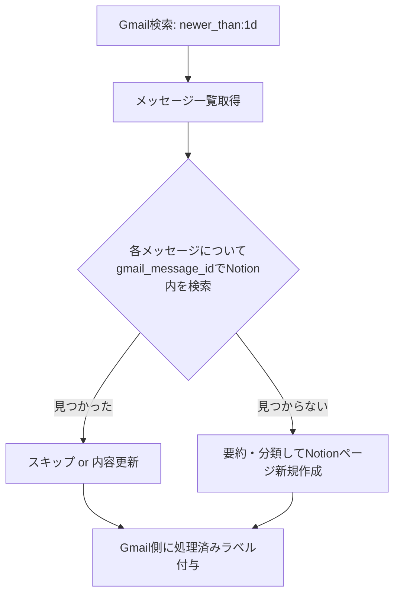

## この記事で得られること

- 同じGmail検索クエリを毎時実行するタイプのバッチで、Notion DBへの**重複登録を防ぐべき等性設計**の実装パターン
- Notion APIには**DBレベルのユニーク制約が存在しない**という前提を踏まえた、アプリ側での重複判定ロジック
- Notion API 2025-09-03で入った**Data Source API（`/v1/data_sources/...`）への移行**が、既存のdatabase.query前提のコードにどう影響するか
- Notion APIの平均レート制限（3 req/s per integration）に対する、429発生時のリトライ設計

## 背景・課題

複数のメールマガジンや通知メールから必要な情報だけを拾ってNotion DBに集約する「受信メールの一次仕分けバッチ」を運用しています。Gmail検索は`newer_than:1d`のような相対条件で対象を絞るため、バッチを1時間おきに実行すると、前回すでに処理済みのメールも当然また検索結果に含まれてきます。

ここで何も対策しないと、同じメールの内容が実行のたびにNotion DBへ新規ページとして追加され、DBがすぐに重複だらけになります。RDBであれば`UNIQUE`制約を張って`ON CONFLICT`で弾けば済む話ですが、Notion DBにはそもそもそういった一意性制約の機能がありません。つまり「重複させない」ことの責任は、Notion側ではなく完全にアプリ側（バッチのコード）にあります。

## 実際の取り組み

### 1. 一意キーの設計

GmailのメッセージIDをそのままNotion側のプロパティに保存し、登録前に「同じ`gmail_message_id`を持つページが既に存在するか」をクエリで確認する方式にしました。



メッセージ本文のハッシュ値ではなくメッセージIDそのものをキーにしたのは、「同じメールを2回処理したら常に同じ結果になってほしい（べき等性）」という要件に対して、ID一致の方がシンプルに保証しやすかったためです。本文の要約結果は同じ入力でもLLMの出力が微妙に揺れる可能性がありますが、「同じメッセージIDならスキップする」というルール自体はLLMの出力ゆらぎに影響されません。

### 2. Notion Data Source APIへの移行が地味に必要だった

Notion APIは2025年9月にリリースされた`2025-09-03`バージョンで、データモデルに破壊的変更が入っています。[公式のアップグレードガイド](https://developers.notion.com/guides/get-started/upgrade-guide-2025-09-03)によると、1つのデータベースが複数の「データソース」を持てるようになり、これまで`/v1/databases/{id}/query`で行っていたクエリは`/v1/data_sources/{id}/query`に置き換わりました。

古いAPIバージョンのまま実装したコードを使い続けていた場合、対象のNotion DBに誰かが（自分自身も含めて）データソースを追加した瞬間に、ページ作成・DB読み書き・クエリが軒並み失敗し始めるという破壊的な影響があります。今回の実装では最初からdata_sources APIを使う前提で組みましたが、もし数ヶ月前に書いたコードをそのまま流用していたら、ある日突然バッチだけがエラーを吐き始めていたはずです。ネット上のNotion APIサンプルコードは`databases.query`ベースのものがまだ多く残っているため、実装前に必ず公式ドキュメントのバージョンを確認する価値がありました。

```python
# 2025-09-03 以降の書き方（data_sources ベース）
resp = notion.data_sources.query(
    data_source_id=DATA_SOURCE_ID,
    filter={
        "property": "gmail_message_id",
        "rich_text": {"equals": message_id},
    },
)
exists = len(resp["results"]) > 0
```

### 3. レート制限とリトライ

[Notion公式のレート制限ドキュメント](https://developers.notion.com/reference/request-limits)では、インテグレーションごとに平均3 req/sの制限があり、短時間のバーストは許容されるものの、これを超えて429が返るケースがあると説明されています。一次仕分けバッチは1回の実行で数十件のメールをまとめて処理するため、重複チェックのクエリと登録の両方でNotion APIを叩くと、素朴なループ実装だとバースト上限に触れやすい構成でした。

対策として、Notion API呼び出し部分だけを薄くラップして、429が返った場合は`Retry-After`ヘッダーを尊重して待機する形にしています。

```python
import time
import httpx

def call_with_retry(fn, *args, max_retries=5, **kwargs):
    for attempt in range(max_retries):
        try:
            return fn(*args, **kwargs)
        except httpx.HTTPStatusError as e:
            if e.response.status_code == 429 and attempt < max_retries - 1:
                wait = int(e.response.headers.get("Retry-After", "1"))
                time.sleep(wait)
                continue
            raise
```

## 得られた知見

- 「重複させない」責任は完全にアプリ側にある、という前提に立つと、キー設計をどこまでシンプルにできるかが実装の見通しの良さに直結する。メッセージIDのような不変な一意識別子がある場合は、それをそのまま使うのが一番事故が少ない
- Notion APIのようなSaaS APIは、破壊的変更が「ドキュメントの片隅」ではなく専用のアップグレードガイドとして明示されることがある。定期実行バッチは一度動き出すと見に行く機会が減るため、依存しているAPIのバージョン更新情報を定期的に確認する運用がないと、ある日サイレントに壊れる
- レート制限は「エラーになったら再試行する」でとりあえず動くが、`Retry-After`ヘッダーを無視した固定秒数のリトライにすると、バースト上限に近い状況で再試行の波が重なりやすい。ヘッダーの値をそのまま使うだけで安定性が変わった

## 数字の実測

`[ここに実際の数値を記入]`（1回の実行あたりの処理件数、重複スキップ件数、429発生率、手動での重複削除にかかっていた作業時間との比較）

このバッチ自体は安定稼働しているものの、上記の定量比較はまだ十分な期間のログを取れていないため、実測が揃い次第別記事で追記します。

## 代替手段との比較

| 手段 | メリット | デメリット |
|---|---|---|
| メッセージIDをキーに事前クエリ（今回の方式） | 実装がシンプル、べき等性を保証しやすい | 処理件数分だけNotion APIへの問い合わせが増える |
| Gmail側でラベル管理し処理済みを除外 | Notion側へのクエリが減らせる | ラベル操作の失敗時に二重処理のリスクが残る（Notion側のガードが無いと事故る） |
| Zapier / Make等のノーコード連携 | 実装コストが低い | 429やAPIバージョン変更時の挙動をブラックボックスで扱うことになり、原因調査がしづらい |

今回は「Gmail側のラベル管理」と「Notion側の事前クエリ」を両方組み合わせています。片方だけに頼ると、どちらかの操作が失敗したときに重複が発生する経路が残るためです。

## Q&A

**Q. Notion DB側にユニーク制約に相当する機能は本当に無いのか？**
A. 2026年8月時点の公式ドキュメントを確認した範囲では、プロパティ値の一意性を保証するネイティブな制約は見当たりませんでした。select/multi-selectのような選択肢制限や数値・日付のフォーマット検証はありますが、いずれも「値の一意性」を保証するものではありません。

**Q. なぜハッシュ値ではなくGmailのメッセージIDをキーにしたのか？**
A. メッセージIDはGmail側が発行する不変な識別子で、同じメールに対して常に同じ値になることが保証されています。本文からハッシュを取る方式も検討しましたが、要約前のテキスト抽出処理に手を入れるたびにハッシュ値が変わりうる設計になってしまうため、より安定した識別子を選びました。

**Q. data_sources APIへの移行で他に踏んだ罠は？**
A. 既存のデータベースIDとデータソースIDは初期状態では1:1で対応しますが、概念として別物になったため、コード中で両者の変数名を混同しないように注意が必要でした。

## まとめ

- Notion DBには重複防止のネイティブ機構が無いため、キー設計とクエリによる事前チェックをアプリ側で実装する必要がある
- Gmailのメッセージ ID のような不変な識別子をキーにすることで、べき等性の保証がシンプルになる
- Notion API 2025-09-03のData Source API移行は、既存コードを塩漬けにしていると気づかないうちに壊れる類の破壊的変更なので、定期実行バッチほど依存APIのバージョン確認を怠らない方がよい
- レート制限のリトライは固定秒数ではなく`Retry-After`ヘッダーに従う方が安定する

## 参考リンク

- [Request limits - Notion Docs](https://developers.notion.com/reference/request-limits)
- [Upgrade guide - Notion Docs (2025-09-03)](https://developers.notion.com/guides/get-started/upgrade-guide-2025-09-03)
- [FAQs: Version 2025-09-03 - Notion Docs](https://developers.notion.com/docs/upgrade-faqs-2025-09-03)
