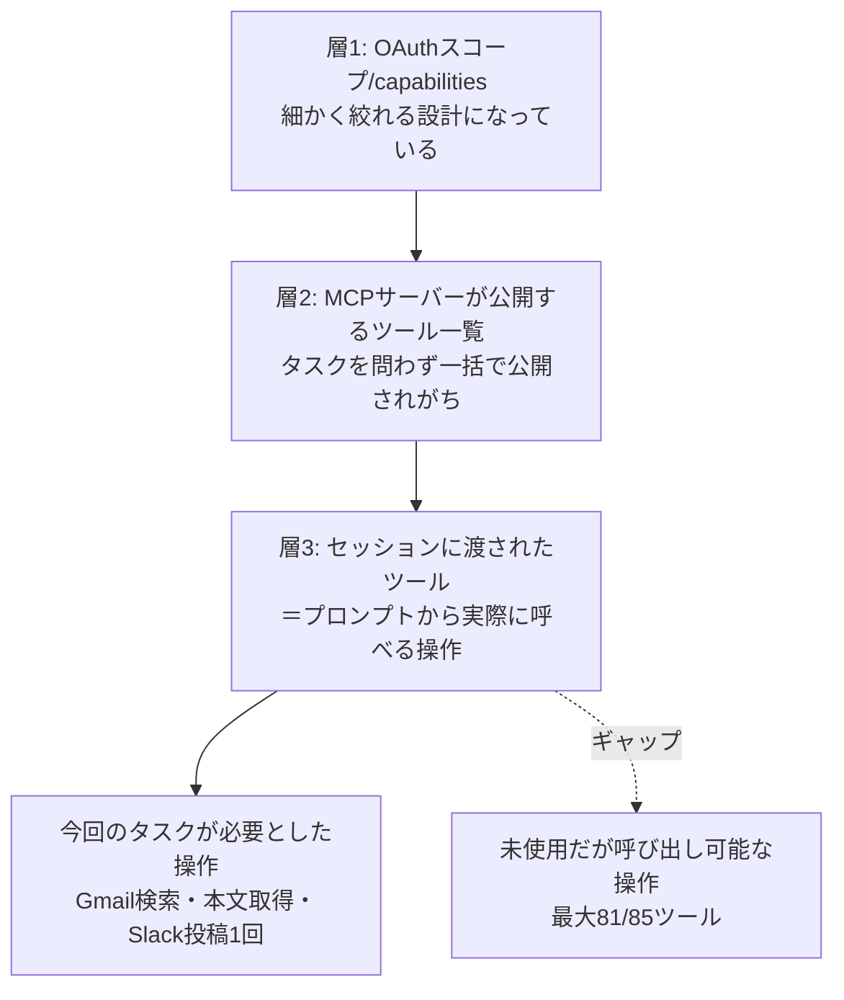

## この記事で得られること

- Gmail・Slack・NotionのOAuthスコープ／capabilities設計はどれも「最小権限で絞れる」ようにできているのに、AIエージェントに渡す**MCPツール一覧**という層では、その粒度がそのまま活きていない、という構造的なギャップの話
- 個人で運用している自動化Routine（夜間バッチ）の実際のツール定義を数えたところ、Gmail連携29個中2個、Slack連携19個中2個、Notion連携37個中0個しか使っていなかった、という実測値
- 「なぜこのギャップが生まれるのか」という設計側の理由の推測と、個人開発者が今日からできる2つの対処（`allowed_tools`での絞り込み／未使用connectorの削除）

## 背景：セキュリティ診断の目で自分の自動化を見たら

セキュリティ診断の仕事では「このトークンで何ができるか」を洗い出すのが基本動作です。個人開発でGmail・Slack・Notionを繋いだRoutine（Claude Code Remoteのスケジュール実行機能）を複数運用するようになってから、この基本動作を自分の環境に向けたことがありませんでした。

夜間に「Qiita/Zennのニュースレターを検索して読み、良さそうな切り口があれば記事下書きを作ってSlackに1通投稿する」というタスクだけをこなすRoutineがあります。タスク自体は単純ですが、接続されているGmail/Slack/Notionの3つのMCPコネクタが、実際にはどこまでの操作を"技術的に"実行できる状態になっているのかを一度も確認していませんでした。

## 権限モデルを3層に分けて考える

まず、各サービスが公式にどういう粒度で権限を絞れるようになっているかを確認しました（各社ドキュメントより）。

| サービス | 絞り込みの単位 | 例 |
|---|---|---|
| Gmail API | OAuthスコープ（読み取り専用と書き込み系が別スコープ） | `gmail.readonly` / `gmail.modify` / `gmail.metadata`（[Restricted Scopes - Google Cloud Platform Console Help](https://support.google.com/cloud/answer/13464325)） |
| Slack API | リソース＋操作クラス（read/write/history）の組み合わせ | `channels:read` / `chat:write`（[Scopes - Slack Developer Docs](https://api.slack.com/scopes)） |
| Notion API | capability単位＋ページ/DB単位の個別同意 | Read content / Update content / Insert content（[Connection capabilities - Notion Docs](https://developers.notion.com/reference/capabilities)） |

3社とも、アプリ開発者がOAuth連携を組む段階ではかなり細かく絞れます。ここが「層1：OAuthスコープ/capabilities」です。

その上に乗るのが「層2：MCPサーバーが公開するツール一覧」です。ここでいくら層1で読み取り専用スコープに絞っていても、MCPサーバー自体が汎用的に作られていれば、「読み取り系ツールだけ」を公開するとは限りません。そして「層3：AIエージェントのセッションに実際に渡されたツール」があり、ここがプロンプトから直接呼べる最終的な操作範囲になります。

層1の丁寧な設計が、層3まで届いていない。これが今回自分の環境で実測して分かったことです。

## 実測：3コネクタで85ツール中、使ったのは最大4

対象Routineに定義されているツール数と、実際の実行ログで呼んだツール数を突き合わせました。

| コネクタ | 定義数 | 使用数 | 未使用の中に含まれる操作の例 |
|---|---|---|---|
| Gmail | 29 | 2 | メール送信・返信・転送、ゴミ箱移動、迷惑メール登録、ラベル操作 |
| Slack | 19 | 最大2 | 任意ユーザーとのDM/グループDM作成、プライベートチャンネル横断検索 |
| Notion | 37 | 0 | ページ/DB作成、ページ移動、他セッションの起動 |

Gmailの`send_message`や`forward`が呼べる状態にあるということは、少なくとも送信系スコープを含む形で連携済みであることを示唆しています（連携設定そのものは確認しておらず、ツールの存在から推測できる範囲です）。読み取りだけで完結するタスクに対して、送信・削除まで技術的に可能な状態が渡っているのは、層1で用意されている粒度が生かされていない典型例だと感じました。

## なぜこのギャップが生まれるのか（推測）

汎用のGmail/Slack/Notion MCPサーバーは、1つのタスク専用ではなく「いろいろなRoutineから使い回す」前提で作られていることが多いはずです。あるRoutineはメール送信が必要で、別のRoutineは検索だけでいい、という状況で、サーバー側が毎回ツール構成を出し分けるより、フルセットを公開して呼び出し側（プロンプトや`allowed_tools`）に絞り込みを委ねる方が実装コストが低い、という判断は理解できます。

問題は、呼び出し側でその絞り込みを**意識的に行っていたか**という点でした。今回のRoutineでは、Gmail/Slack/Notionのどれも「connectorとして繋がっている」以上のチェックをしておらず、`allowed_tools`側での個別ツール指定もしていませんでした。

## 代替手段の比較：今日からできる対処

| 対処 | 効果 | コスト | 今回の状況 |
|---|---|---|---|
| OAuth連携自体をread-onlyスコープで結び直す | 層1から確実に塞げる。送信・削除が物理的に不可能になる | 連携の再設定が必要。ユーザー側の作業 | 未着手 |
| Routineの`allowed_tools`でツール名を個別指定する（例: Gmailは`search_threads`と`get_message`のみ） | 層3で確実に塞げる。ツールがセッションに現れなくなる | 設定ファイルの見直しのみ、比較的低コスト | 次回の設計変更候補 |
| 未使用のconnectorをRoutineから外す（今回のNotion） | シンプルにアタックサーフェスをゼロにできる | 最も低コスト | 次回対応予定 |
| プロンプト内で「使ってよい操作」を書く | 呼び出し自体は可能なままなので、指示追従に依存する | 追加設定不要だが確実性は最も低い | 今回の運用はこの状態だった |

一番コストが低く効果が高いのは「未使用connectorを外す」でした。Notionは今回のタスクで一度も呼ばれていないため、次回の設計見直しで連携そのものを外す予定です。次点は`allowed_tools`でのツール名の個別指定で、こちらはOAuth連携の再設定が不要な分、着手しやすい対処でした。

## よくある疑問

**Q. `allowed_tools`で絞ればOAuthスコープ自体は絞らなくてもいいのか？**
A. 層3だけを塞いでも、層1（OAuthスコープ）が広いままなら、設定ミスや別のRoutineへの流用時に同じ広さのツールが再度渡ってしまいます。両方を絞るのが理想ですが、着手コストが低い層3からまず対処する、という順序は現実的な落とし所だと考えています。

**Q. 未使用のツールがあること自体は、そんなに問題なのか？**
A. 「技術的に実行可能な操作の集合」が「タスクに必要な操作の集合」より大きい状態は、最小権限の原則には反しています。実際の悪用可能性はプロンプトインジェクション等の外部要因に依存するため本記事だけでは定量化できませんが（`[ここに実際の誤動作率やインシデント件数があれば記入]`）、アタックサーフェスが不必要に広いこと自体は独立した問題です。

**Q. 3層モデルはこの記事オリジナルの分類か？**
A. 独自の整理です。各社の公式ドキュメントはOAuthスコープ/capabilities（層1）の説明はしていますが、MCPサーバーがそれをどうツールとして再公開するか（層2〜3）は各サーバーの実装依存であり、横断的な基準がまだ一般化されていないという印象を持っています。

## まとめ

- Gmail/Slack/Notionは、OAuthスコープ/capabilitiesという層では最小権限に絞れる設計になっている
- しかしMCPサーバーがそれをツールとして公開する層、そしてセッションに渡される層では、その粒度が引き継がれず、タスクに不要な送信・削除系ツールまで技術的に呼べる状態になっていた（3コネクタ合計85ツール中、使用は最大4）
- 対処としては、OAuth連携自体のスコープ見直しより先に、`allowed_tools`でのツール名の個別指定と、未使用connectorの削除から着手するのが低コストで現実的だった

## 参考リンク

- [Restricted Scopes - Google Cloud Platform Console Help](https://support.google.com/cloud/answer/13464325)
- [Scopes - Slack Developer Docs](https://api.slack.com/scopes)
- [Connection capabilities - Notion Docs](https://developers.notion.com/reference/capabilities)
- [Automate work with routines - Claude Code Docs](https://code.claude.com/docs/en/routines)
