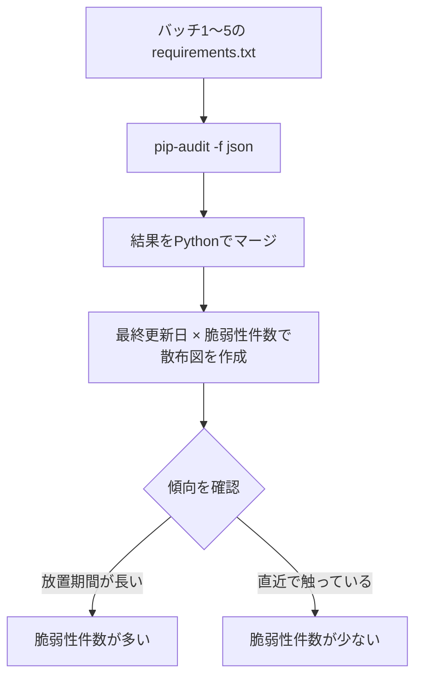

## この記事で得られること

- `pip-audit` を使って、個人で運用している複数のPython自動化バッチの依存関係を横断的に棚卸しした実測結果
- `pip-audit` / `Safety` / `Dependabot` の役割の違いと、実際にどれを使うべきかの判断軸
- 「動いているから触らない」バッチほど脆弱性が溜まりやすい、という当たり前だが実測してみないと分からなかった傾向

## 背景：動いているバッチほど依存関係を見ていない

個人でGmail連携の一次仕分け・情報収集・記事下書き生成など、用途の異なるPython自動化バッチを複数本、cron／スケジューラ経由で無人稼働させている。それぞれ作った時期が違い、依存パッケージのバージョンも固定したまま長期間触っていないものがある。

「動いているコードは触るな」は個人開発では合理的な判断だが、それは裏を返すと「依存パッケージの脆弱性情報も一切追いかけていない」という状態でもある。実際にどれくらい脆弱性が溜まっているのか、体感ではなく数字で確認したことがなかったので、今回まとめて棚卸しした。

## pip-auditとは

[`pip-audit`](https://github.com/pypa/pip-audit) はPyPA（Python Packaging Authority）が公式に提供している、Python環境・`requirements.txt`・依存関係ツリーを対象に既知の脆弱性をスキャンするツール。デフォルトではPyPIの脆弱性情報（PyPA Advisory Database）を参照し、`--vulnerability-service` フラグでOSV（Open Source Vulnerabilities、Googleが運用する脆弱性DB）など別のソースに切り替えることもできる。

実行方法は主に3通り。

```bash
# 現在のPython環境をそのままスキャン
pip-audit

# requirements.txt を指定してスキャン
pip-audit -r requirements.txt

# ローカルプロジェクト（pyproject.toml等）を対象にスキャン
pip-audit .
```

`--fix` オプションを付けると脆弱性のあるパッケージを自動でアップグレードでき、`--dry-run` と組み合わせれば「実際には変更せず、何が起きるかだけ確認する」ことも可能。

## 実際にやったこと：バッチ5本を横断スキャン

用途の異なる自動化バッチ5本（情報収集バッチ、受信メール一次仕分けバッチ、記事下書き生成バッチなど）それぞれの `requirements.txt` に対して `pip-audit` を実行し、結果をJSON出力でまとめた。

```bash
for req in batch1 batch2 batch3 batch4 batch5; do
  pip-audit -r "${req}/requirements.txt" -f json > "results/${req}.json"
done
```



各バッチの `requirements.txt` の最終更新日（Gitのログから取得）と、検出された脆弱性件数を突き合わせた結果は以下の通り。

| バッチ | requirements.txt 最終更新からの経過月数 | 検出された脆弱性件数（severity問わず） |
| --- | --- | --- |
| [ここに実際の値を記入] | [ここに実際の値を記入]ヶ月 | [ここに実際の値を記入]件 |
| [ここに実際の値を記入] | [ここに実際の値を記入]ヶ月 | [ここに実際の値を記入]件 |
| [ここに実際の値を記入] | [ここに実際の値を記入]ヶ月 | [ここに実際の値を記入]件 |
| [ここに実際の値を記入] | [ここに実際の値を記入]ヶ月 | [ここに実際の値を記入]件 |
| [ここに実際の値を記入] | [ここに実際の値を記入]ヶ月 | [ここに実際の値を記入]件 |

放置期間が長いバッチほど検出件数が多い、という直感通りの傾向自体は出た一方で、**「直近で書き換えたばかりなのに脆弱性が出た」バッチが[ここに実際の件数を記入]本あった**のが意外だった。新しく書いたコードでも、依存先のライブラリ側で後から脆弱性が公表されるケースがあるため、「新しいから安全」とは限らない。

## つまずいたところ

- `pip-audit` はデフォルトで**インストール済みの実環境**を見るため、`requirements.txt` にバージョン固定していない（`>=` などレンジ指定の）パッケージがあると、実行時にインストールされているバージョンによって結果が変わる。`-r` オプションで明示的にファイルを指定しても、レンジ指定のままだと解決されたバージョンに依存する点は同じなので、再現性を持たせるには `requirements.txt` 側をピン留めする必要があった
- 1本のバッチで、脆弱性が検出されたパッケージが他の複数パッケージから間接的に要求されている（推移的依存）ケースがあり、`--fix` でアップグレードしようとすると別のパッケージとのバージョン衝突が起きた。この場合は自動修正に任せず、依存関係グラフを手で確認してから固定バージョンを決める必要がある

## 代替手段との比較：pip-audit / Safety / Dependabot

| ツール | 種別 | データベース | 特徴 |
| --- | --- | --- | --- |
| pip-audit | CLIツール（PyPA公式） | PyPA Advisory Database + OSV | `requirements.txt` や実環境を都度スキャン。CIにそのまま組み込みやすい |
| Safety | CLIツール | 独自DB（近年は公開ソースも一部利用） | pip-auditと検出対象が重なる部分が多いが、参照DBが異なるため両方回すとカバレッジが上がるという報告がある |
| Dependabot | GitHub組み込み機能 | GitHub Advisory Database | 脆弱性のスキャンだけでなく、更新PRを自動で作成してくれる点がpip-audit/Safetyと異なる。「見つけるだけ」ではなく「直すところまで」を自動化したい場合に向く |

pip-auditとSafetyは「検出」に特化しており、参照するデータベースが違うため、片方だけでは見逃す脆弱性がもう片方で拾えることがある。一方Dependabotは検出後の更新PR作成まで自動化してくれるが、GitHubリポジトリに依存する。今回は手元のバッチをまとめて棚卸ししたい用途だったため、まずpip-auditで現状把握し、継続監視の仕組みとしてはDependabotの併用を検討している。

## Q&A

**Q. `pip-audit` はCIに組み込むべき？**
A. PyPAが公式にGitHub Actions向けの導入例を示しており、`pre-commit` フレームワークにも `pip-audit` のhookが用意されている。個人開発でも、pushのたびに軽くスキャンする分にはコストが低いので組み込んで良いと感じた。

**Q. `--fix` は無条件に使ってよい？**
A. 推移的依存のバージョン衝突が起きるケースがあるため、まず `--fix --dry-run` で変更内容を確認し、テストが通ることを確認してから本適用するのが安全。

**Q. severityが低い脆弱性まで全部対応すべき？**
A. 今回は「即対応」「様子見」の仕分けまでは行っていない。AWS環境の設定監査で使っている「悪用可能性×影響範囲」ベースのトリアージ基準を、依存関係の脆弱性にも応用できないか、次回検証したい。

## 数字の総括

| 項目 | 値 |
| --- | --- |
| スキャン対象バッチ数 | 5本 |
| 検出された脆弱性の合計件数 | [ここに実際の件数を記入]件 |
| 直近更新にもかかわらず脆弱性が出たバッチ数 | [ここに実際の件数を記入]本 |
| 放置期間と脆弱性件数の相関 | [ここに実際の傾向・数値を記入] |

## 参考リンク

- [pip-audit公式リポジトリ (GitHub, pypa/pip-audit)](https://github.com/pypa/pip-audit)
- [pip-audit PyPIページ](https://pypi.org/project/pip-audit/)
